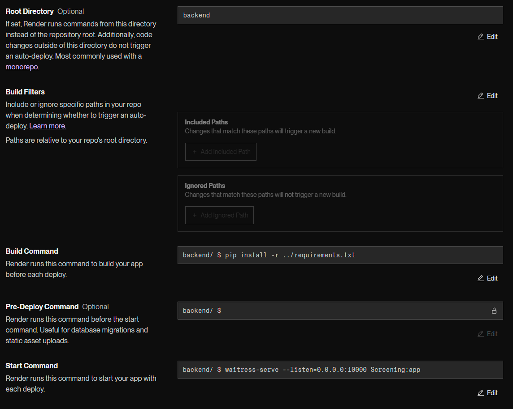

# Screening Master

## Running Instructions

1. **Open a terminal**:

2. **Clone the repository**:

   ```sh
   git clone <repository-link>
   ```

3. **Change directory into the repository folder**:

   ```sh
   cd screening-master
   ```

4. **Create a virtual environment**:

   ```sh
   python -m venv venv
   ```

5. **Activate the virtual environment**:

   ```sh
   venv/Scripts/activate
   ```

   Check your virtual environment's python version by running

   ```sh
   python --version
   ```

   If it isn't 3.12.3, then re-training the models may be necessary because of a different version of pickle

6. **Install the necessary packages**:

   ```sh
   pip install -r requirements.txt
   ```

7. **Run the backend**:

   ```sh
   flask run
   ```

**NOTE** If you run into an error when running the code here,
go ahead and empty the pkls folder located at 'backend/data/pkls'
and then run the command

```sh
python backend/Screening.py
```

in order to retrain all the models and make the necessary files.
Be warned that this action could take a lot of computation (Time and CPU)
depending on the classifier you are using.
Gradient Boosting is one of the fastest to train (estimated 5 minutes),
Random Trees is one of the slowest (estimated 20 minutes).

8. **To quit and shutdown the server**:
   Press `CTRL+C`

9. **To exit the virtual environment**:

```sh
deactivate
```

## Render Running Settings



## Customization Instructions

1. **Choosing which Model**:
   In "backend/functions/models.py" the train_model function can be modified to use a different classifier.
   Add the needed data into the csvs folder, name the csv file "unique_filtered_final_with_target_variable.csv".
   Delete the final_model.pkl file and run the following command to train a new model.
   ```sh
   python backend/Screening.py
   ```
   The link to the application may not display in terminal but it defaults to http://127.0.0.1:5000.
   If needed, after the line
   ```sh
   "Starting Flask app"
   ```
   is printed to terminal, you can hit
   ```sh
   "CTRL+C"
   ```
   to quit and then restart the server using
   ```sh
   flask run
   ```
2. **Choosing to run analytics**:
   The analyze_numerical_features function can also be added into Screening.py to generate graphs and statistics about the model when the application is run.

## Other Considerations

1. **Re-training the Model**:
   To retrain the models you need to make use of the 'unique_filtered_final_with_target_variable.csv' file which contains the training data.
   To have the models retrain, just delete the 'final_model.pkl' file from the data/pkls folder and run the code using 'python backend/Screening.py'
2. **API Documentation Link**:
   https://screening-master.apidocumentation.com/reference
3. **Company Search Page**:
   Currently deprecated since the csv is too large and requires too much RAM to load.
