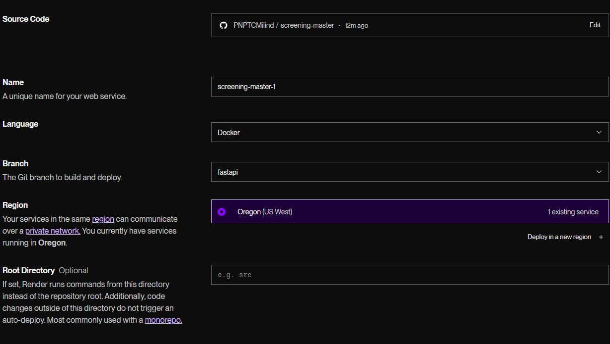

# Screening Master

## Running Instructions

1. **Open a terminal**:

2. **Clone the repository**:

   ```sh
   git clone https://github.com/Siralde/screening-master.git
   ```

3. **Change directory into the repository folder**:

   ```sh
   cd screening-master
   ```

4. **Create a virtual environment**:

   ```sh
   python -m venv venv
   ```

5. **Activate the virtual environment**:

   ```sh
   venv/Scripts/activate
   ```

   Check your virtual environment's python version by running

   ```sh
   python --version
   ```

   If it isn't 3.12.3, then re-training the models may be necessary because of a different version of pickle

6. **Install the necessary packages**:

   ```sh
   pip install -r requirements.txt
   ```

   Create a .env file and place a variable named SECRET_KEY into it.
   Use the following script to generate a SECRET_KEY for yourself

   ```sh
   import secrets
   secret_key = secrets.token_hex(32)
   print(f"Your secret key: {secret_key}")
   ```

7. **Run the backend**:

   ```sh
   cd backend
   uvicorn fastapi_app:app --reload
   ```

**NOTE** If you run into an error when running the code here,
go ahead and empty the pkls folder located at 'backend/data/pkls'
and then run the command

```sh
python fastapi_app.py
```

or

```sh
python backend/fastapi_app.py
```

depending on what your current directory is

in order to retrain all the models and make the necessary files.
Be warned that this action could take a lot of computation (Time and CPU)
depending on the classifier you are using.
Gradient Boosting is one of the fastest to train (estimated 5 minutes),
Random Trees is one of the slowest (estimated 20 minutes).

Visit the /docs route of the given root to see an openapi specification of the available endpoints
i.e. [127.0.0.1](http://127.0.0.1:8000/docs)
There is no root page html.

8. **To quit and shutdown the server**:
   Press `CTRL+C`

9. **To exit the virtual environment**:

```sh
deactivate
```

10. **Run an API call like so to get an access token for use with the other endpoints**

```sh
curl -X POST "(base url goes here)/token" -H "Content-Type: application/x-www-form-urlencoded" -d "username=johndoe&password=secret"
```

## Render Running Settings



Also remember to paste the environment variables before deploying.

## Customization Instructions

1. **Choosing which Model**:
   In "backend/functions/models.py" the train_model function can be modified to use a different classifier.
   Add the needed data into the csvs folder, name the csv file "unique_filtered_final_with_target_variable.csv".
   Delete the final_model.pkl file and run the following command to train a new model.
   ```sh
   python backend/fastapi_app.py
   ```
   The link to the application may not display in terminal but it defaults to http://127.0.0.1:5000.
2. **Choosing to run analytics**:
   The analyze_numerical_features function can also be added into fastapi_app.py to generate graphs and statistics about the model when the application is run.

## Other Considerations

1. **Re-training the Model**:
   To retrain the models you need to make use of the 'unique_filtered_final_with_target_variable.csv' file which contains the training data.
   To have the models retrain, just delete the 'final_model.pkl' file from the data/pkls folder and run the code using 'python backend/fastapi_app.py'
2. **API Documentation Link**:
   https://screening-master.apidocumentation.com/reference
   You can also visit the /docs route of your running application.
3. **Company Search Page**:
   Currently deprecated since the csv is too large and requires too much RAM to load.

## Notes On API Usage:

1. **Documentation**:
   https://screening-master.apidocumentation.com/reference
2. **Examples Of Ways To Call**:
   Python
   ```sh
   import requests
   response = requests.post('http://127.0.0.1:5000/predict', json=data)
   ```
   Node.js
   ```sh
   import axios from 'axios';
   axios.get('http://127.0.0.1:5000/predict')
   ```
   Curl
   ```sh
   curl -X POST http://127.0.0.1:5000/predict -H "Content-Type: application/json" -d '{"key1":"value1", "key2":"value2"}'
   ```
   Check the Documenation for the required parameters.

## Notes On OAuth2:

- Currently there is a commented out line in the arguments list of each endpoint which if uncommented
  will allow the usage of OAuth.
- The user will have to submit a username and password to the /token route and receive a token which they can use
  when calling the other endpoints.
- This is just a very basic OAuth setup and will require more secure measures as well as a good username/password
  and a database to keep track of keys and such.
